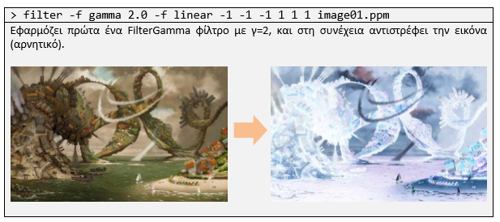
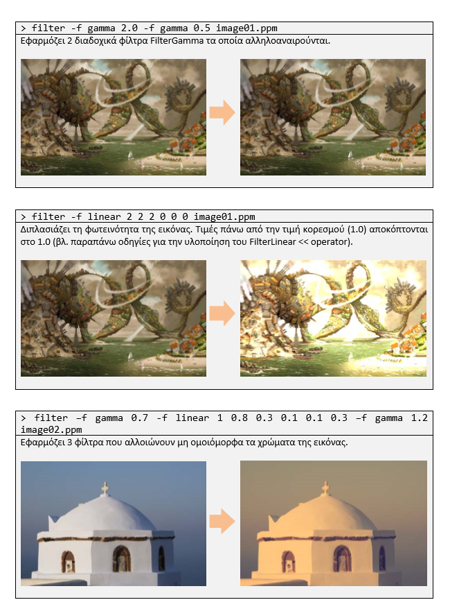
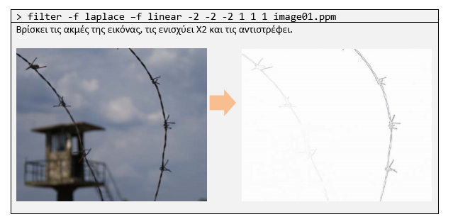

# ImageFiltering
Assignment in Computer Programming in C++ at AUEB during autumn of 2017-2018
  
__Authors:__ 

   * [Vasileios Mormoris](https://github.com/VMormoris) 
   * [Nikolaos Paterakis](https://github.com/PaterakisNikos) 

*The assignment was split in two parts. The second one was the continuation of the first part. So here we have only the second one*

  

  * [pronunciation of part 1]() 
  * [pronunciation of part 2]() 
## Examples of how to use the program:

  
   
  
   
  
